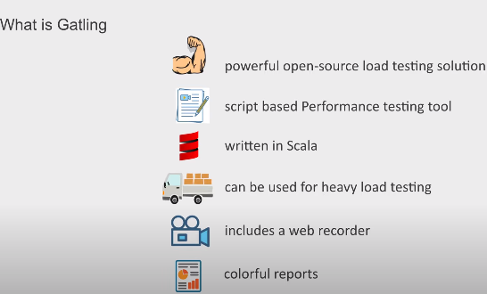
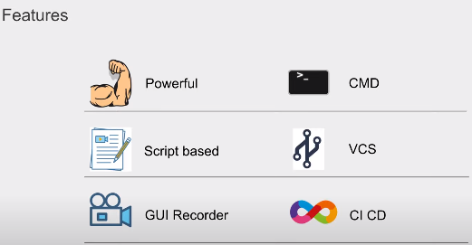

## What is Gatling?
- Gatling is an **open-source load testing tool written in Scala and used to test the performance and scalability of web applications**.
- It is designed to simulate a high number of users accessing an application simultaneously, in order to identify bottlenecks and other issues that may impact the application's performance under heavy load.
- **ver 3.7+ supports Java, Kotlin and Scala.**
- Luanched in 13 January 2012.

##  What is Scala?
- Scala is a programming language that **run on the Java virtual machine(JVM) and is designed to be expressive, concise and type-safe.**
- It combines the best features of functional programming languages, such as **immutability and first-class functions, with the benefits of object-oriented programming, such as encapsulation and inheritance.**
- It is widely used in a range of applications, including data processing, distributed systems, and web development. **It is known for it's ability to scale up to large programs and support concurrency, making it well-suited for building high performance and distributed systems.**

## What are the benefits of Gatling?
- It is a script based performance testing tool which includes a web recorder and colorful reports. 
- Gatling is written in Scala and uses an expressive DSL(Domain Specific Language) to define test scenarios. 
- It is highly customizable, allowing users to fine-tune their load tests and generate detailed reports on the performance of their applications.
- Gatling also integrates with a range of tools and technologies, such as Jenkins, Maven and Gradle, making it easy to incorporate into an existing build and deployment workflow.

## Who uses Gatling?
- Gatling is commonly used by developers, quality assurance professionals, and other technical stakeholders to ensure that applications can handle the expected load and provide a good user experience.

## Features of Gatling

## Akka toolkit
- **Gatling is build on top of toolkit called Akka.**
- **Akka is a toolkit for building highly concurrent and distributed message-driven applications for Java and Scala.**
- **Akka's message driven architecture enables Gatling to implement virtual users as messages instead of dedicated threads, making them very resource cheap.**
- This is because **Akka overrides the JVM limitation of handling many threads.**
- **Virtual users in Gatling are messages not threads.**